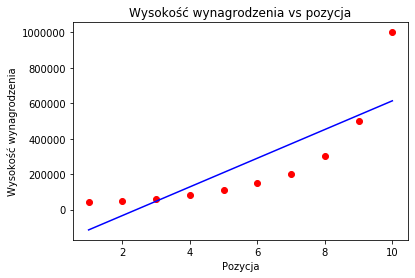
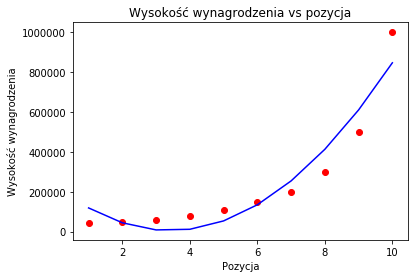
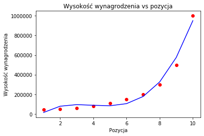
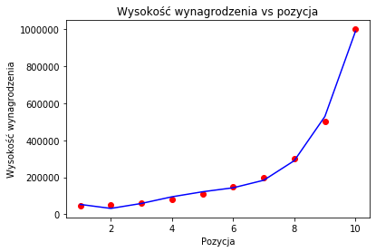

# Laboratorium 3
## Ćwiczenie 1
### Dane

<table border="1" class="dataframe">
  <thead>
    <tr style="text-align: right;">
      <th></th>
      <th>Position</th>
      <th>Level</th>
      <th>Salary</th>
    </tr>
  </thead>
  <tbody>
    <tr>
      <th>0</th>
      <td>Business Analyst</td>
      <td>1</td>
      <td>45000</td>
    </tr>
    <tr>
      <th>1</th>
      <td>Junior Consultant</td>
      <td>2</td>
      <td>50000</td>
    </tr>
    <tr>
      <th>2</th>
      <td>Senior Consultant</td>
      <td>3</td>
      <td>60000</td>
    </tr>
    <tr>
      <th>3</th>
      <td>Manager</td>
      <td>4</td>
      <td>80000</td>
    </tr>
    <tr>
      <th>4</th>
      <td>Country Manager</td>
      <td>5</td>
      <td>110000</td>
    </tr>
    <tr>
      <th>5</th>
      <td>Region Manager</td>
      <td>6</td>
      <td>150000</td>
    </tr>
    <tr>
      <th>6</th>
      <td>Partner</td>
      <td>7</td>
      <td>200000</td>
    </tr>
    <tr>
      <th>7</th>
      <td>Senior Partner</td>
      <td>8</td>
      <td>300000</td>
    </tr>
    <tr>
      <th>8</th>
      <td>C-level</td>
      <td>9</td>
      <td>500000</td>
    </tr>
    <tr>
      <th>9</th>
      <td>CEO</td>
      <td>10</td>
      <td>1000000</td>
    </tr>
  </tbody>
</table>

### Wykres wyniku regresji liniowej 

### Wielomian, stopień 2

### Wielomian, stopień 3

### dWielomian, stopień 4

### Wartości obliczone dla level 6 salary, dla kolejnych stopni wielomianu

<ol>
    <li>289939.39393939</li>
    <li>134484.84848485</li>
    <li>104820.51282051</li>
    <li>143275.05827509</li>
</ol>

### Który z modeli dokonał najlepszej predykcji parametru Salary dla Level = 6? Czym to jest spowodowane?

Najlepszej predykcji dokonał model korzystający z funkcji wielomianowej najwyższego stopnia, ponieważ wartości danych nie zmieniają się liniowo. Jednocześnie, ponieważ nie pasują one do prostej funkcji kwadratowej, zwiększanie stopnia wielomianu pozwala na lepsze dostosowanie modelu. Ma to oczywiście swoje granice, wynikające ze stosunku kosztu (np. czasu przetwarzania danych i wymaganej mocy obliczeniowej) do korzyści wynikających z dokładności predykcji. Zbyt wysoki stopień może także wprowadzić niepotrzebny szum do danych o dużej zmienności.